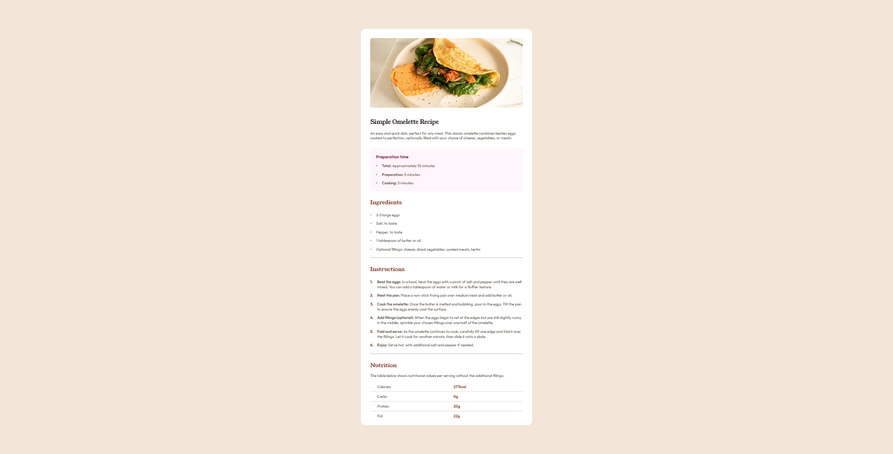

# Frontend Mentor - Recipe page solution

This is a solution to the [Recipe page challenge on Frontend Mentor](https://www.frontendmentor.io/challenges/recipe-page-KiTsR8QQKm). Frontend Mentor challenges help you improve your coding skills by building realistic projects. 

## Table of contents

- [Overview](#overview)
  - [Screenshot](#screenshot)
  - [Links](#links)
- [My process](#my-process)
  - [Built with](#built-with)
  - [What I learned](#what-i-learned)
  - [Continued development](#continued-development)
  - [Useful resources](#useful-resources)
- [Author](#author)
- [Acknowledgments](#acknowledgments)

## Overview

### Screenshot




### Links

- Solution URL: [Add solution URL here](https://github.com/MariaCMontO/blog-preview-card-cmo)

## My process

### Built with

- Semantic HTML5 markup
- CSS custom properties
- Flexbox

### What I learned

With this project I learned how to center a div using flexbox on the body element in CSS. I also learned how to reset default HTML styles on elements like paragraphs, among other things.
In this project, I worked with the rem unit, so I used a configuration on the html element to make 1rem=10px.
I learned how to use a box-shadow.

```css
html {
    font-size: 62.5%;
}
main {
    background-color: var(--white);
    width: 38.4rem;
    height: 52.2rem;
    border: 0.2rem solid #111111;
    border-radius: 2rem;
    padding: 2.4rem;
    box-shadow: 0.8rem 0.8rem 0rem 0rem #111111;
}
```

### Continued development

I definitely want to keep developing interfaces using the rem unit - it makes many task much easier. However, I also want to improve my understanding about paddings and margins to become a more practical and efficient developer. 

### Useful resources

## Author

- Frontend Mentor - [@MariaCMontO](https://github.com/MariaCMontO)


## Acknowledgments
